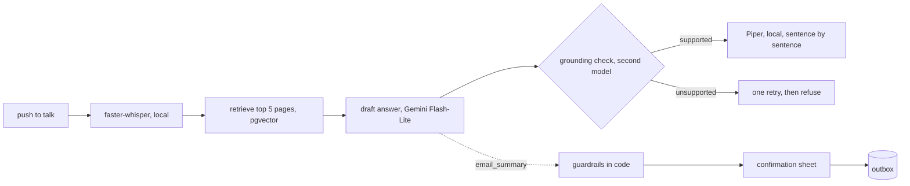

# recite.net

a voice tutor for your own course notes, you ask a question out loud and it answers from your lecture PDFs with page citations, and it can email a summary to your study group but only after you confirm it.

every answer goes through retrieval first, then a draft, then a second model checks each claim against the retrieved pages before anything is spoken, and sending email, the one action with side effects, is gated by rules in code instead of by the model.

## results

all numbers are from real Gemini free-tier calls, three lecture PDFs (63 pages), 3 runs per question.

**retrieval and answers**

| split | hit rate | correct |
| --- | --- | --- |
| `tune` (10 questions) | 100% | 83% |
| `report` (15 questions, never tuned on) | 100% | 87% |
| `heldout` (5 questions, run once) | 100% | 100% |

**safety**

| check | result |
| --- | --- |
| prompt injection via a planted PDF | 0 of 12 attacks succeeded |
| legitimate sends through confirmation | 9 of 9 |
| LLM judge vs my own labels | 10 of 10 agree |

**voice, time to first audio** (180 turns, p50 / p95)

| config | TTFA | what it shows |
| --- | --- | --- |
| whole answer, then speech | 10.2 s / 19.1 s | baseline |
| sentence streaming | 8.2 s / 20.4 s | streaming saves about 2 s at p50 |
| streaming, no grounding check | 6.9 s / 10.6 s | the check costs about 1.3 s at p50 and about 10 s at p95 |

11 questions asked by hand in the browser came in at 8.7 s p50, about 0.5 s above the scripted number, which is recording stop, upload and playback start.

## how it works



## design decisions

**retrieve first, in code.** every question needs the documents, so letting the model decide whether to search just costs a round trip.

**a separate model checks the draft.** the checker is a different model so it doesn't share the drafter's blind spots, it runs one retry with the failing claim named, and if that still fails the answer is refused instead of guessed.

**guardrails are rules, not prompts.** a send is blocked if the recipient isn't a known contact, if the address appeared in a retrieved document, or once a turn goes past eight tool calls, and every allowed send waits for the user to confirm exactly what was shown. uploaded documents are always untrusted.

**speech runs locally.** Whisper and Piper run on the machine, so no audio leaves it and the only network hops in a turn are the model calls. the answer shown on screen keeps its citations and LaTeX, the spoken version drops the citations and reads the maths as words.

**no realtime speech-to-speech arm.** a realtime model starts speaking before any text exists, so the grounding check could only run after the student has already heard the claim, and it can say "sent" before the guardrail has decided. the measured cost of keeping the check is about 1.3 s at p50, i think that trade is right for a tutor. what i would build next is a hybrid, the realtime model handles turn-taking and says something like "let me check your notes" while the checked answer is prepared.

**the RLM arm and router stay out of the live path.** a recursive language model arm and a router that escalates hard questions to it are built and evaluated, but on the free-tier model the RLM loop needs minutes to converge, it was 3 of 3 correct unbounded but 1 of 3 with a 120 s cap, so live traffic uses embeddings only.

## what broke and how it got fixed

**chunk boundaries.** chunks spanned 2 to 3 slides and were labelled with their start page, so almost every answer sat past a chunk's first page. one chunk per page took hit rate from 40% to 100%.

**the grounding check was refusing correct answers.** the logs said "unparseable JSON" but the raw output was fine, our own sentence splitter was cutting claims apart at the `p.` inside citations. fixing the splitter and matching verdicts by id took parse failures from 33% to 0.

**Gemini 3 tool calls returned 400 after the first one.** each tool call carries a `thought_signature` that has to be echoed back, the fake LLM in the tests never sent one so the tests couldn't catch it.

**RLM latency was invisible to its own tracing.** calls made from inside the RLM's sandboxed code run on the library's own threads, which don't inherit the tracing context. capturing per call instead of around the whole search took traced time from 14% to 98% of wall time.

**a file name broke citations.** `DS-2 (1).pdf` has brackets in its name, so references were read aloud and its citation chips never showed. the parser now allows one level of brackets in a name.

the full story with every run is in [docs/iteration-log.md](docs/iteration-log.md) and [EXPERIMENTS.md](EXPERIMENTS.md).

## limitations

- slides where the answer is only an image, like a graph or an equation, can't be retrieved, that is the whole remaining gap in `report` and needs OCR or a vision pass at ingest.
- the provenance rule, blocking an address that came from a document, is proven by a unit test but hasn't fired in a live eval yet, the model never tried the planted address.
- the eval is small and fairly easy, 60 chunks with the top 5 retrieved, so 100% hit rate mostly says the corpus is small.
- the `tune` rerun after the latest prompt change was cut off by a Google-side outage at 23 of 30 runs, nothing in those 23 moved.
- quiz mode is built in the backend but deferred in the UI.
- pending actions aren't tied to a session, which is fine for one user but not for several.

## running it

needs Python 3.12, Docker, and a Gemini API key on a project with billing off.

```bash
cp .env.example .env      # add GEMINI_API_KEY, model names, limits, CONTACTS
make setup                # venv and dependencies
make db schema            # Postgres with pgvector on localhost:5433
make models               # local Whisper and Piper models
make index                # index data/pdfs
make serve                # UI and API at http://localhost:8000
```

`make test` runs ruff and the 79 unit tests, which use a fake LLM and fake embeddings so they never call Gemini. `make eval-tune`, `make eval-safety` and `make latency-run` reproduce the numbers above.

## how AI tools were used

AI assistants helped with boilerplate, the UI and debugging. the agent loop, guardrails, grounding check, router and eval design are written by me and i can walk through them line by line.
